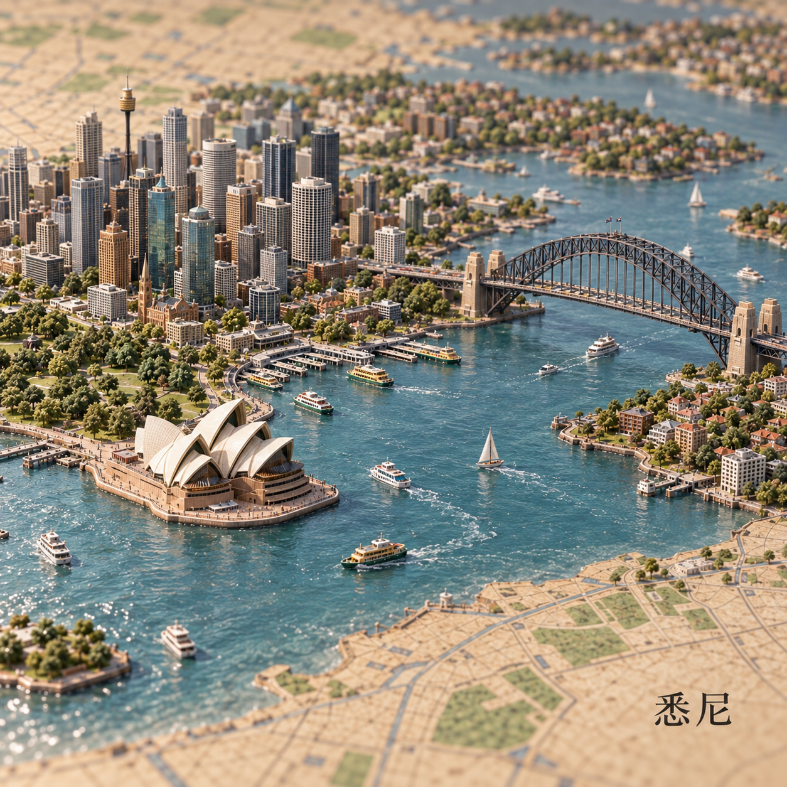
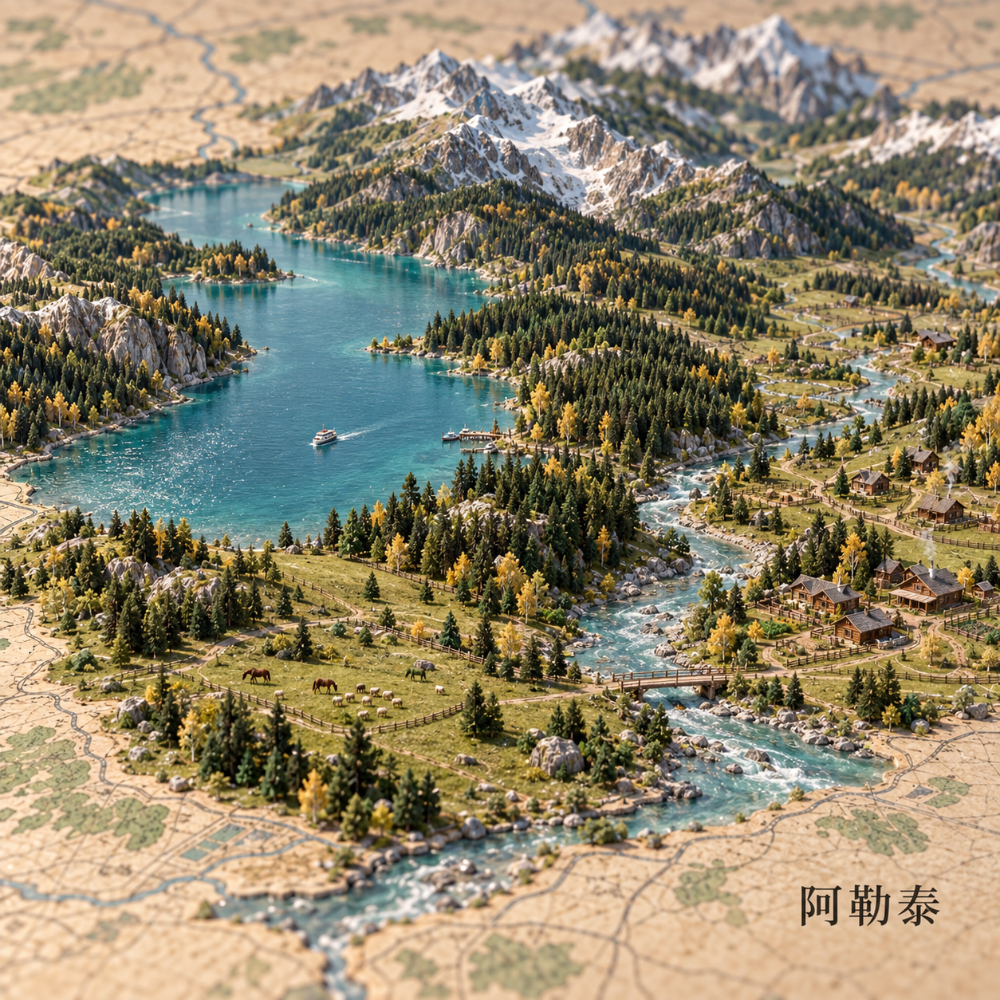
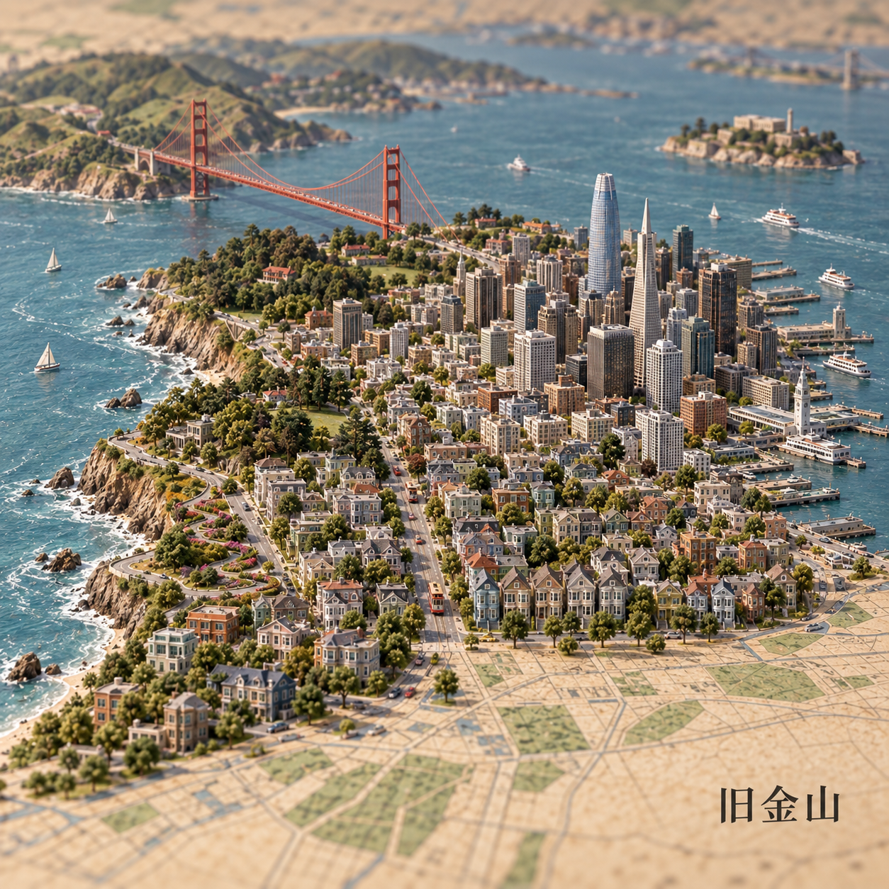
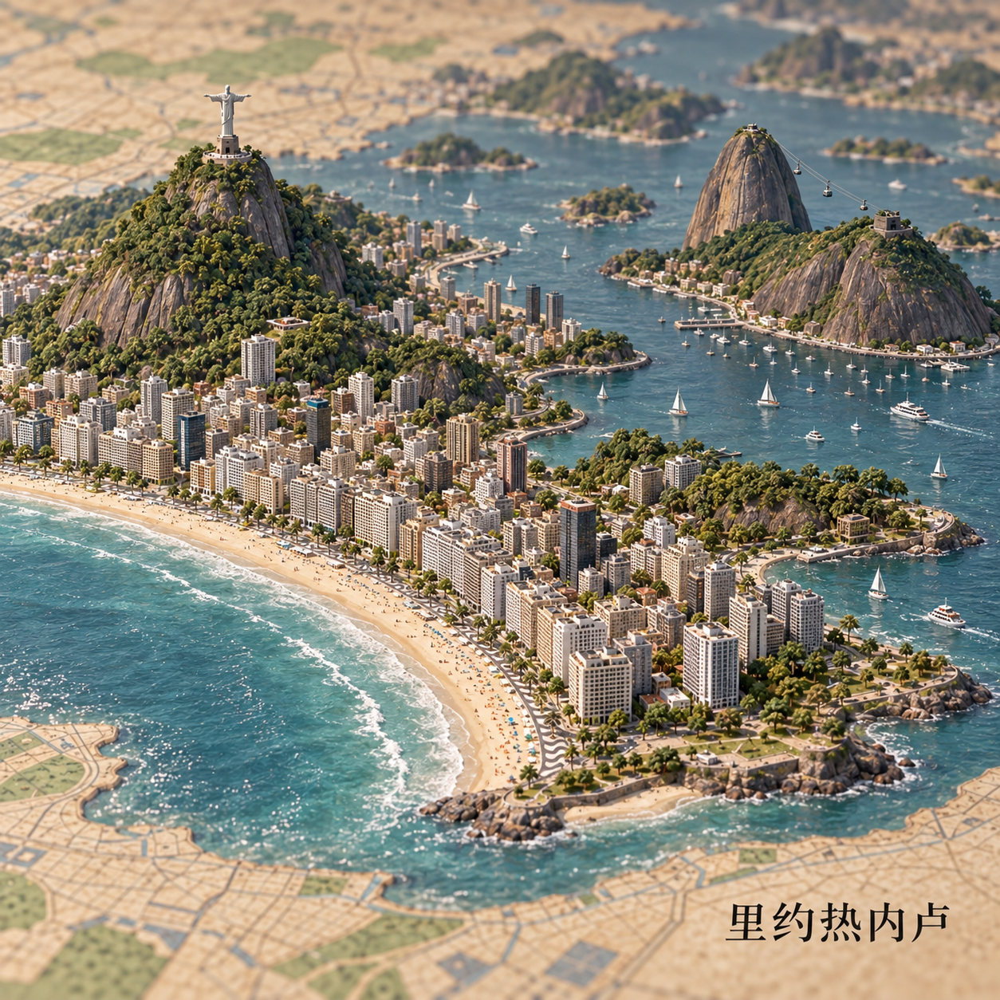
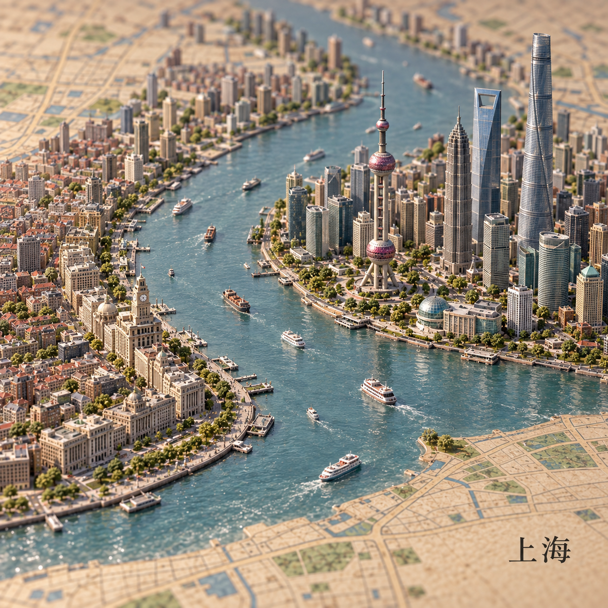
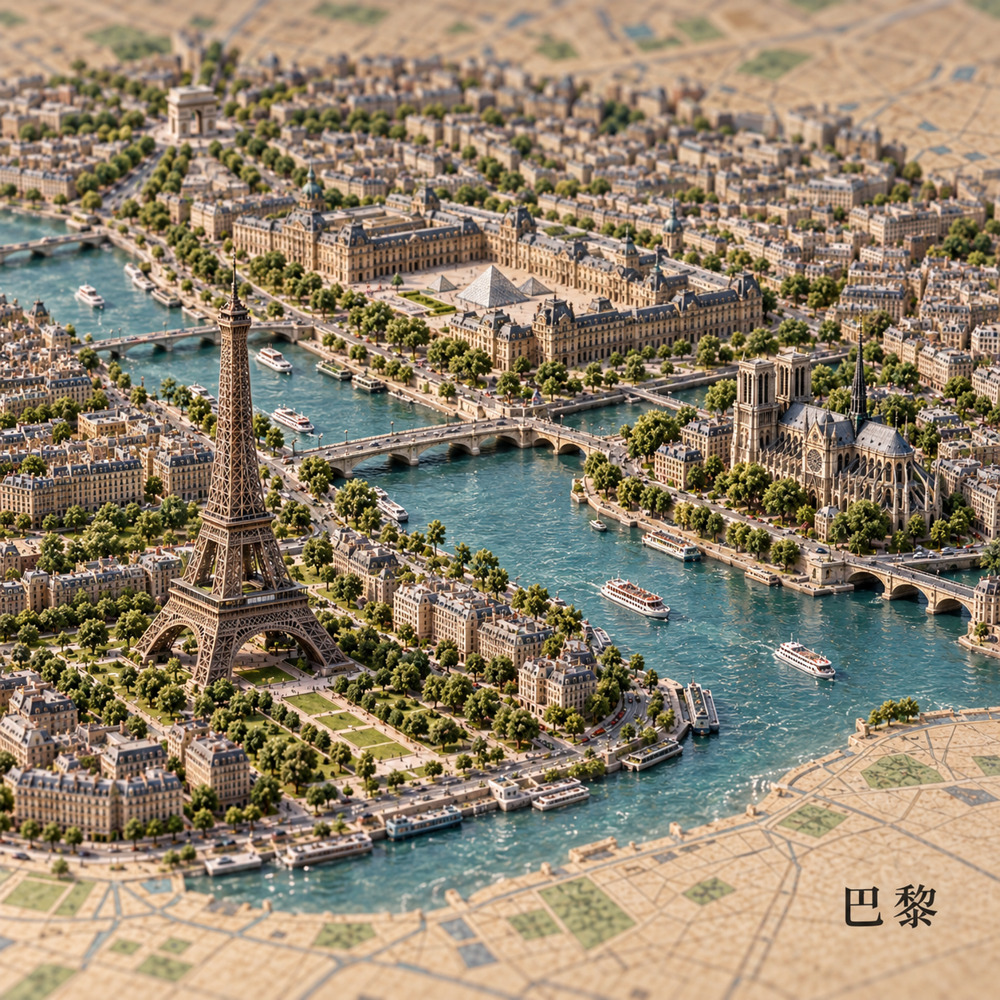
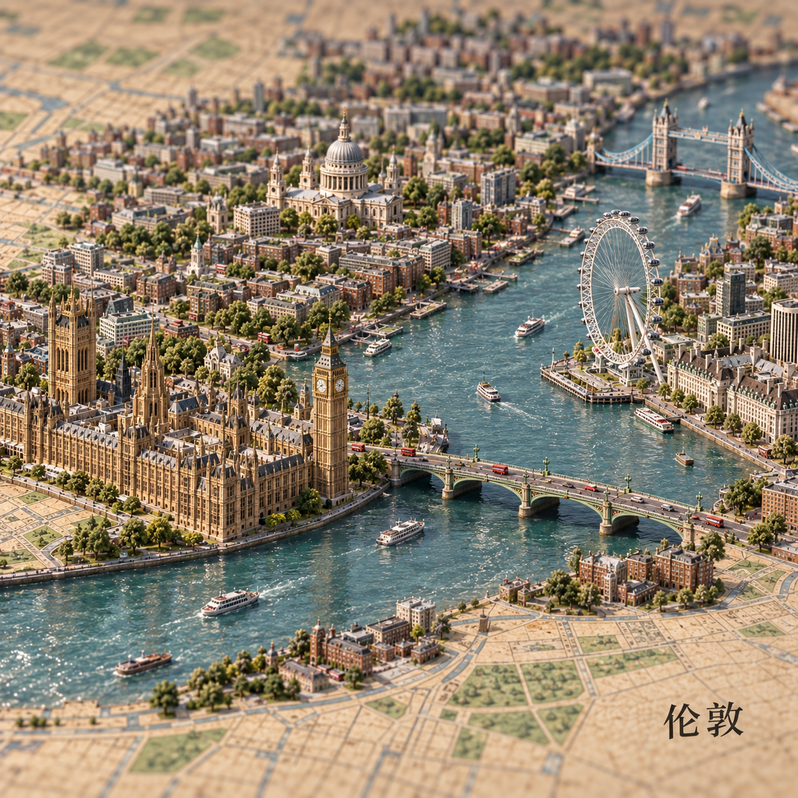
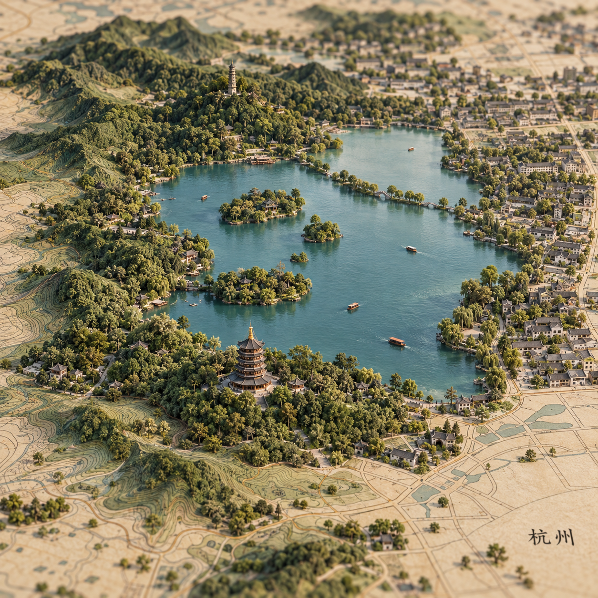
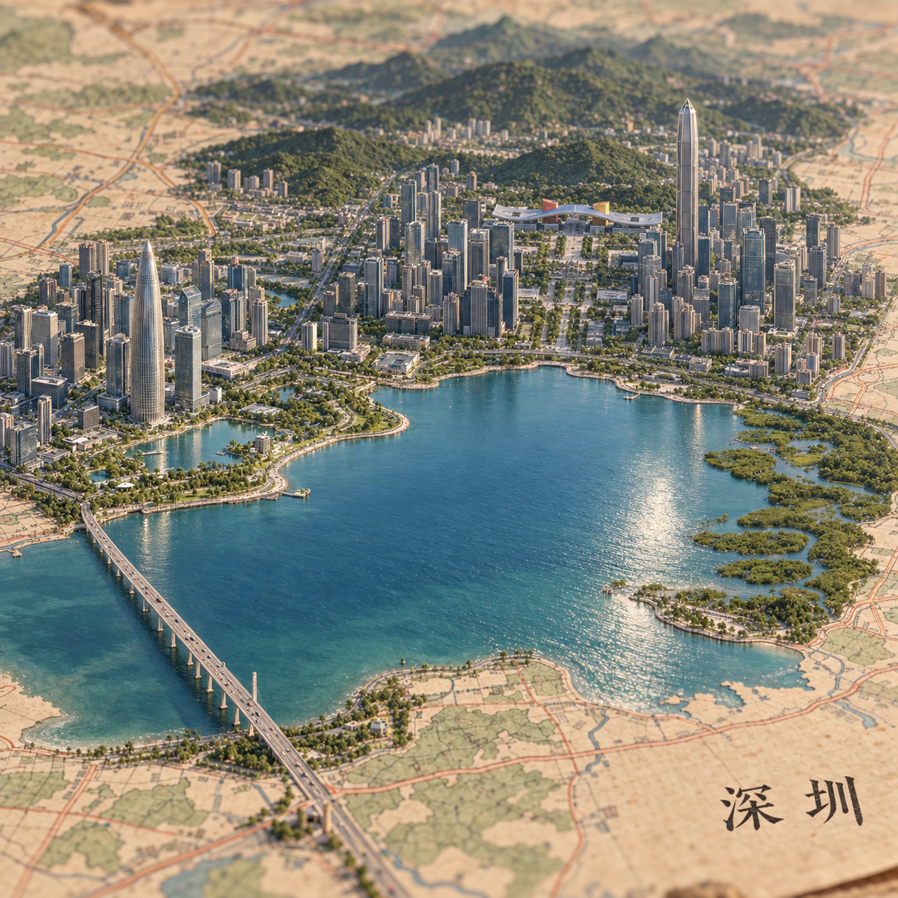

<h1 align="center">方寸山河 · 微缩景观</h1>

<h3 align="center">让一座城，从地图里长出来。</h3>

<p align="center">一个生成和编辑微缩景观图的 Agent Skill，让城市、山川与地标从复古地图中自然浮起，呈现精致手作模型的质感。</p>

<p align="center"><a href="README.md">English</a> · <strong>简体中文</strong></p>

<p align="center">
  <a href="LICENSE"></a>
  
  
</p>



## 精选案例

以下 9 张为创作者选定的 AI 生成案例。点击图片查看原图，Prompt 链接保留实际使用的生成提示词。杭州、深圳采用单独选定版本，其余七张使用纽约图作风格参考，详见[案例说明](examples/README.md)。

| | | |
| --- | --- | --- |
| [](examples/images/altay.png) | [](examples/images/san-francisco.png) | [](examples/images/sydney.png) |
| **阿勒泰 · Altay** · [Prompt](examples/prompts/altay.txt) | **旧金山 · San Francisco** · [Prompt](examples/prompts/san-francisco.txt) | **悉尼 · Sydney** · [Prompt](examples/prompts/sydney.txt) |
| [](examples/images/rio-de-janeiro.png) | [](examples/images/shanghai.png) | [](examples/images/paris.png) |
| **里约热内卢 · Rio de Janeiro** · [Prompt](examples/prompts/rio-de-janeiro.txt) | **上海 · Shanghai** · [Prompt](examples/prompts/shanghai.txt) | **巴黎 · Paris** · [Prompt](examples/prompts/paris.txt) |
| [](examples/images/london.png) | [](examples/images/hangzhou.png) | [](examples/images/shenzhen.png) |
| **伦敦 · London** · [Prompt](examples/prompts/london.txt) | **杭州 · Hangzhou** · [Prompt](examples/prompts/hangzhou.txt) | **深圳 · Shenzhen** · [Prompt](examples/prompts/shenzhen.txt) |

## 它能做什么

- **一个地点，一张微缩世界。** 城市、湖山、村落、庭院与幻想景观均可创作。
- **地图自然长成立体景观。** 路网接入街区，印刷岸线过渡为水岸，不默认添加厚底座。
- **微缩感来自材料和摄影。** 植绒树、涂装建筑、雕刻山石与微距景深共同建立尺度。
- **跟随参考，而不是套同一座城。** 保留选定的密度、光线和材质，每个地点有自己的空间关系。
- **支持成套创作与局部修改。** 也可只输出提示词，或按要求修改画幅、季节、时段与文字。

默认采用 1:1 方图、复古地图、温暖侧光和一个简短地名。用户要求始终优先；喜欢饱满街区时，不会机械减成稀疏玩具。

## 在 Codex 中安装

需要支持 Agent Skills 的 Codex 环境。实际出图还需要该环境可用的图像生成/编辑工具；本仓库提供指令和案例，不包含独立渲染服务、API 密钥或专用模型。

在尚未安装此 Skill 时运行：

```bash
mkdir -p ~/.agents/skills
git clone https://github.com/carpediem67/miniature-landscape.git ~/.agents/skills/miniature-landscape
```

重新开启会话后，用 `$miniature-landscape` 调用。若目标目录已经存在，请先检查现有安装，不要覆盖自定义修改或重复安装。也可下载 [Releases](https://github.com/carpediem67/miniature-landscape/releases) 中的 ZIP，解压后将 Skill 文件夹放到相同目录。

其他支持 `SKILL.md` 的助手可按其安装约定加载；已验证的创作环境是 Codex，其他宿主尚未逐一测试。优先使用宿主提供的内置图像工具，不绑定某个图像模型版本，也不会自动切换到付费 API。

## 直接开始

```text
用 $miniature-landscape 做一张巴黎的微缩景观。
```

```text
用 $miniature-landscape 做阿勒泰的秋天：湖泊、针叶林、金色白桦和木屋，保留地图纸面，不要文字。
```

```text
参考附件的材质、建筑密度和景深，用 $miniature-landscape 做上海、伦敦、悉尼，各一张。
```

```text
用 $miniature-landscape 修改这张图：保留地标和构图，把光线改成清晨，不增加建筑。
```

支持中文或英文提出需求；地名标注语言、画幅及风格均可指定。只有提示词需求时，请明确说“只给提示词，不出图”。

## 为什么更像微缩模型

重点不是给航拍图加模糊，而是让纸纤维、模型树冠、建筑刻纹、小船与接触阴影提供尺寸参照。主要地标保持可读，前后景物沿焦平面渐次柔化。建筑密集或景观开阔均可成立，关键是服从地点与参考图。

Skill 的执行说明保持简洁，包含用户要求优先、参考图用途区分、必要的地理核对、实际出图和成图检查。案例只在需要时查看，不要求每次加载全部图片。

## 仓库内容

| 文件 | 用途 |
| --- | --- |
| [SKILL.md](SKILL.md) | Codex 执行说明与发现元数据 |
| [agents/openai.yaml](agents/openai.yaml) | 名称、简介和默认调用示例 |
| [examples/](examples/README.md) | 9 张精选案例、实际提示词和风格参考 |
| [README.md](README.md) | 默认英文说明 |
| [LICENSE](LICENSE) | MIT 许可证 |

## 使用范围与许可

这些作品是艺术化缩景，会压缩地理距离并简化建筑，不是测绘地图或可编辑 3D 资产。图像生成具有随机性，案例展示效果而非保证逐像素复现。

本仓库的 Skill、文档、提示词和随附示例按 [MIT License](LICENSE) 发布。使用、修改及再分发时保留许可证与版权声明。图像由 AI 生成；第三方商标及其他权利不因本仓库的许可而转让。

由 [carpediem67](https://github.com/carpediem67) 创作与维护。独立社区项目，非 OpenAI 官方产品。
